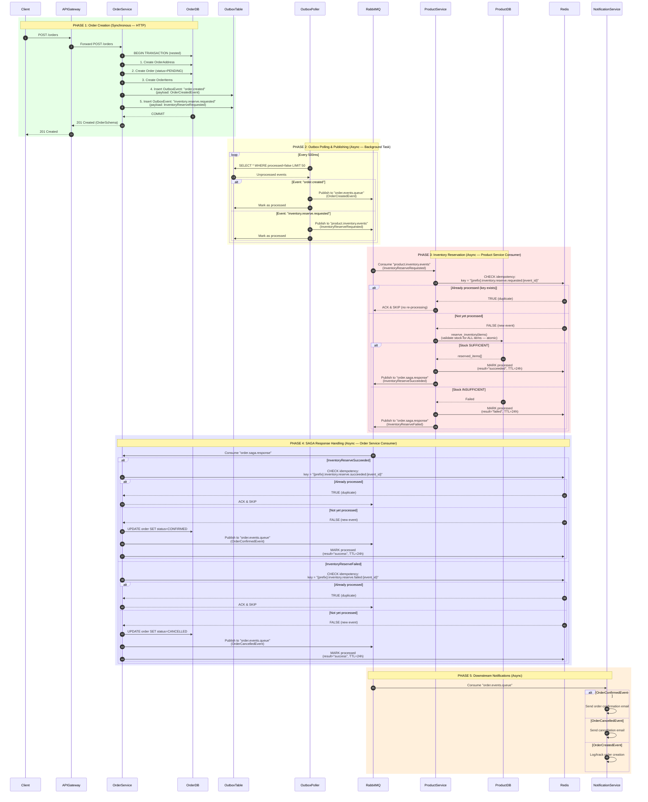

# Order Creation Flow — Event Flow Diagram

## Overview

This diagram traces the complete order creation flow from API call through all asynchronous events,
including **idempotency checks** and **duplicate prevention** at each step.

---

## Complete Flow Diagram (Mermaid)



---

## RabbitMQ Queue Topology

```
┌─────────────────────────────────────────────────────────────────────────────┐
│                            RabbitMQ Que                                      │
├─────────────────────────────────────────────────────────────────────────────┤
│                                                                             │
│  ┌──────────────────────────┐                                               │
│  │  order.events.queue      │◄──── OrderService (publishes)                │
│  │  (DLQ: order.events.dlq) │     - OrderCreatedEvent                       │
│  └──────────────────────────┘     - OrderConfirmedEvent                     │
│           │                       - OrderCancelledEvent                     │
│           │                                                                │
│           ▼                                                                │
│  ┌──────────────────────────┐                                               │
│  │  Notification Service    │     Handles email notifications               │
│  └──────────────────────────┘                                               │
│                                                                             │
│  ┌──────────────────────────┐                                               │
│  │  product.inventory.events│◄──── OrderService (publishes)                │
│  │  (DLQ: ...events.dlq)    │     - InventoryReserveRequested               │
│  └──────────────────────────┘     - InventoryReleaseRequested               │
│           │                                                                │
│           ▼                                                                │
│  ┌──────────────────────────┐                                               │
│  │  Product Service         │     Reserves/releases inventory               │
│  └──────────────────────────┘                                               │
│                                                                             │
│  ┌──────────────────────────┐                                               │
│  │  order.saga.response     │◄──── Product Service (publishes)             │
│  │  (DLQ: ...response.dlq)  │     - InventoryReserveSucceeded               │
│  └──────────────────────────┘     - InventoryReserveFailed                  │
│           │                                                                │
│           ▼                                                                │
│  ┌──────────────────────────┐                                               │
│  │  Order Service (Consumer)│     Confirms/cancels order                    │
│  └──────────────────────────┘                                               │
│                                                                             │
└─────────────────────────────────────────────────────────────────────────────┘
```

---

## Idempotency & Duplicate Prevention Analysis

### Where Duplicates Could Occur & How They're Prevented

| # | Potential Duplicate Scenario | Prevention Mechanism | Status |
|---|------------------------------|---------------------|--------|
| 1 | **Outbox poller picks up same event twice** (poll runs before mark-as-processed) | OutboxTable: `processed` flag set AFTER publish; next poll skips `processed=true` rows | ✅ Safe |
| 2 | **RabbitMQ redelivers message** (consumer crashes before ACK) | Redis idempotency check: `is_event_processed(event_id, event_type)` returns `true` for duplicates | ✅ Safe |
| 3 | **Product service receives same `inventory.reserve.requested` twice** | Redis key: `{prefix}:inventory.reserve.requested:{event_id}` — checked BEFORE any DB operation | ✅ Safe |
| 4 | **Order service receives same `inventory.reserve.succeeded` twice** | Redis key: `{prefix}:inventory.reserve.succeeded:{event_id}` — checked BEFORE status update | ✅ Safe |
| 5 | **Order service receives same `inventory.reserve.failed` twice** | Redis key: `{prefix}:inventory.reserve.failed:{event_id}` — checked BEFORE status update | ✅ Safe |
| 6 | **Two outbox poller tasks run simultaneously** | Single background task via `asyncio.create_task()` in lifespan — only ONE instance | ✅ Safe |

### Redis Idempotency Key Format

```
{service_prefix}:{event_type}:{event_id}
```

**Examples:**
```
product-service:inventory.reserve.requested:550e8400-e29b-41d4-a716-446655440000
order-service:inventory.reserve.succeeded:550e8400-e29b-41d4-a716-446655440000
order-service:inventory.reserve.failed:550e8400-e29b-41d4-a716-446655440000
```

**TTL:** 24 hours (after which key expires; event could theoretically be reprocessed, but `event_id` is UUID4 so collision probability is negligible)

---

## Critical Flow Analysis

### ✅ What's Correct

1. **Outbox pattern** — Events are created in the SAME DB transaction as the order (atomicity).
2. **Idempotency at consumer level** — Each consumer checks Redis BEFORE processing.
3. **Failed events are also marked as processed** — Prevents infinite retry loops.
4. **Single poller instance** — Only one background task runs.

### ⚠️ Potential Issues

| # | Issue | Impact | Recommendation |
|---|-------|--------|----------------|
| 1 | **`event_id` generated in event schema constructor** — If outbox poller re-serializes the payload, the `event_id` is preserved from the original event (✅ safe), but if any service creates a NEW event with a NEW `event_id` for the same logical operation, idempotency breaks | Medium | Ensure `event_id` is ALWAYS preserved from the original outbox event — never regenerate |
| 2 | **Outbox poller marks event as processed BEFORE consumer ACKs** — If RabbitMQ publish fails AFTER outbox marks as processed, the event is lost (not retried) | Medium | Consider marking as processed AFTER successful publish confirmation |
| 3 | **No idempotency check for `order.created` event** in notification service — If notification service crashes and reprocesses, duplicate emails could be sent | Low | Add Redis idempotency in notification service consumers |
| 4 | **Redis TTL of 24h** — If system is down >24h and backlog is processed, idempotency keys may have expired | Low (edge case) | Consider longer TTL (48-72h) or persistent idempotency store for critical events |

---

## State Transitions Summary

```
Order Status Flow:
┌─────────┐     ┌─────────┐
│ PENDING │────▶│CONFIRMED│  (inventory.reserve.succeeded)
└────┬────┘     └─────────┘
     │
     │             ┌───────────┐
     └────────────▶│ CANCELLED │  (inventory.reserve.failed)
                   └───────────┘

Outbox Event Flow:
┌──────────────┐     ┌───────────────┐
│ processed=F  │────▶│ processed=T   │
│ (unprocessed)│     │ (processed)   │
└──────────────┘     └───────────────┘

Redis Idempotency Flow:
┌──────────────┐     ┌───────────────┐
│ Key NOT set  │────▶│ Key SET       │
│ (new event)  │     │ (processed)   │
└──────────────┘     └───────────────┘
```

---

## Files Involved in This Flow

| Service | File | Role |
|---------|------|------|
| **Order Service** | `service_layer/order_service.py` | Creates order + outbox events |
| **Order Service** | `service_layer/outbox_poller_service.py` | Polls & publishes events to RabbitMQ |
| **Order Service** | `service_layer/outbox_event_service.py` | Manages outbox event CRUD |
| **Order Service** | `events_publisher/order_event_publisher.py` | Publishes events to RabbitMQ |
| **Order Service** | `events_consumer/order_event_consumer.py` | Consumes SAGA responses |
| **Product Service** | `event_consumer/product_event_consumer.py` | Consumes inventory requests |
| **Product Service** | `event_publisher/event_publisher.py` | Publishes SAGA responses |
| **Shared** | `shared/idempotency_service.py` | Redis-based deduplication |
| **Shared** | `shared/schemas/event_schemas.py` | Pydantic event models |
| **Shared** | `shared/enums/event_enums.py` | Event type & queue enums |
