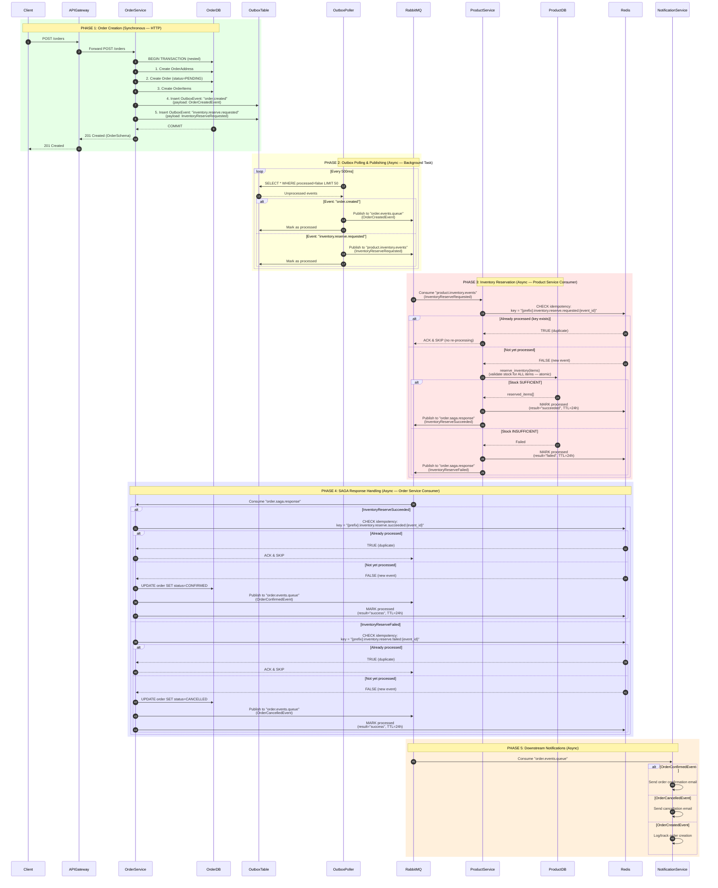

## Getting Started

## Alembic migrations

- Initialize Alembic (if you haven’t):
  `alembic init alembic`

- Generate a new migration file:
  `alembic revision --autogenerate -m "Your migration message"`

- Review and clean up the migration: Check the generated file — remove redundant / incorrect staff or adjust logic as needed.

- Roll back a migration (optional):
  `alembic downgrade -1 / alembic downgrade <revision_id>`

- Mark current DB as up-to-date without running migrations:
  ` alembic stamp head` (if got error about not matching your current models with existing, u can stamp specific idwith: alembic stamp <revision_id> )

- To apply alembic migrations u neeed first to go to the container, then activate venv, then aplly migrations:
  `docker compose exec user-service bash`
  `source .venv/bin/activate`

  # Review the migration file before running!

  `cat alembic/versions/<new_file>.py`

  # If it looks correct (no DROP TABLE), run:

  `alembic upgrade head`

- . Run migrations for each service (MacOS)
  `docker compose exec user-service source .venv/bin/alembic upgrade head`
  `docker compose exec product-service source .venv/bin/alembic upgrade head`
  `docker compose exec notification-service source .venv/bin/alembic upgrade head`

- . Run migrations for each service (MacOS)
  `docker compose exec user-service .venv/bin/alembic upgrade head`
  `docker compose exec product-service .venv/bin/alembic upgrade head`
  `docker compose exec notification-service .venv/bin/alembic upgrade head`

## Redis

Remember to: 1. Cache only read operations 2. Set appropriate expiration times 3. Implement cache invalidation for write operations 4. Monitor cache hit/miss rates 5. Consider cache size and memory usage

Redis docker container
`docker exec -it backend-redis-1 redis-cli` : to check and interact with redis

Auth in Redis
` AUTH your_redis_password`

Select DB of Redis
`SELECT N`

check keys in Redis
`KEYS *`

check value of the key
` GET <KEY>`

Check if Redis is running
`sudo systemctl status redis`

If not running, start it
`sudo systemctl start redis`

`sudo systemctl stop redis`

Make sure Redis is enabled on startup
`sudo systemctl enable redis`

Find process using port 6379
`sudo lsof -i :6379`

Stop the process (if it's another Redis instance)
`sudo systemctl stop redis-server`

## UV

- uv init
- uv venv
- source .venv/bin/activate
- uv add <package_name>
- uv lock
- uv pip list

## FastStream (RabbitMQ)

RabbitMQ url
`http://localhost:15672`

FastStream allows you to scale application right from the command line by running you application in the Process pool.
`faststream run serve:app --workers 2`

Generating of ApiDocs

1.  `docker compose ps` - checking all running services
2.  `docker compose exec notification-consumer sh` - entering the container
3.  `faststream docs serve main:app --host 0.0.0.0 --port 8004` - generatig the
4.  `http://0.0.0.0:8004/docs/asyncapi` - opening generated docs

Once confirmed, open your browser and go to:
http://localhost:15672
You'll see the RabbitMQ Management interface where you can:

View Exchanges (where messages are published)
View Queues (where messages are stored)
View Connections (active connections)
Monitor Message rates
Debug Message flow

Order Creation Flow (Success):
1. User creates order → Order Service
2. Order Service saves order with status=PENDING
3. Order Service publishes: OrderCreatedEvent + InventoryReserveRequested
4. Product Service receives InventoryReserveRequested
5. Product Service reserves inventory
6. Product Service publishes: InventoryReserveSucceeded
7. Order Consumer (this file) receives InventoryReserveSucceeded
8. Order Consumer updates order status=CONFIRMED
9. Order Consumer publishes: OrderConfirmedEvent
10. Notification Service sends confirmation email

Order Creation Flow (Failure):
1-4. Same as above
5. Product Service cannot reserve (out of stock)
6. Product Service publishes: InventoryReserveFailed


## PG Admin

- http://localhost:5050

## Typical target latency budgets (containerized microservices, single region, moderate load):

P50, P95, P99 are latency percentiles.

P50 (50th percentile): Median. 50% of requests are faster than this value, 50% slower.
P95 (95th percentile): 95% of requests complete at or below this time; 5% are slower.
P99 (99th percentile): Tail latency. Only 1% of requests are slower. Shows rare slow cases.

Login (/login):

P50: 80–150 ms
P95: <300 ms
P99: <500 ms Dominant cost: password hash verify (bcrypt 12 cost ~80–200 ms). Acceptable: your 200 ms is fine.
Register (/register):

P50: 120–250 ms (DB insert + token generation)
P95: <600 ms
P99: <900 ms Send email asynchronously (queue) so request isn’t blocked by SMTP/API (email call alone can be 150–400 ms).
Password reset request (/password-reset/request):

P50: 100–180 ms (create token + persist)
P95: <350–400 ms Offload email same as register.
Password reset confirm (/password-reset/confirm):

P50: 90–170 ms (verify token + hash new password + update)
P95: <350 ms
P99: <550 ms
Access token refresh (/refresh):

P50: 40–90 ms
P95: <180 ms
Simple authenticated GET (user profile):

P50: 30–70 ms
P95: <150 ms
List endpoints (small result sets):

P50: 40–90 ms
P95: <180 ms
Write operations (standard DB insert/update):

P50: 50–120 ms
P95: <250 ms
SLO suggestions:

Global: 99% of auth-related requests <500 ms
P95 login/register <300–400 ms
Error rate <0.1%
If you need tighter login times:

Reduce bcrypt rounds (only if policy allows) or switch to Argon2id tuned for ~100 ms
Warm containers (avoid CPU throttling)
Trim excessive synchronous logging
Reuse DB sessions and HTTP clients

## AdminJS

---

## Docker

building the image
`docker build -t user-service .`

running with .env file
`docker run --env-file .env user-service`

` docker compose up --build`

`docker compose restart <service-name>`

Stop containers and remove volumes
`docker compose down -v`

Remove the DB volume (WARNING: deletes all Postgres data!)
`docker volume rm backend_postgres_data`

Remove all existing containers, networks, and volumes
`docker system prune -af --volumes`

Quick one-liner to remove only <none> images:
` docker rmi $(docker images -f "dangling=true" -q)`

rebuild via docker compose
`docker compose build <service-name> --no-cache`

restart via docker compose sepc. service
`docker compose up <service-name>`

Stop the service:
`docker compose stop user-service`

Rebuild with updated code:
`docker compose build user-service`

Start it again (detached):
`docker compose up -d user-service`

Rebuild the specific container
`docker compose up -d --build <container>`


## Recreating the database
1. stop and remove containers and named volumes defined by the compose file
docker compose down -v

2. then build & start (detached)
docker compose up -d --build


┌───────────────────────────────────────────────────────────────────────────────────────────────────────────────────────────────────────────────┐
│                                                                    USER REGISTRATION FLOW                                                     │
└───────────────────────────────────────────────────────────────────────────────────────────────────────────────────────────────────────────────┘

┌──────────┐     ┌────────────────────────────────────────┐     ┌──────────────────┐     ┌──────────────┐     ┌─────────────┐     ┌─────────────┐
│  CLIENT  │     │             API-GATEWAY :8000          │     │  USER-SERVICE    │     │   RABBITMQ   │     │NOTIFICATION │     │  MAILSERVER │
│          │     │                                        │     │  :8001           │     │              │     │  -CONSUMER  │     │             │
└────┬─────┘     └────────────────────┬───────────────────┘     └────────┬─────────┘     └──────┬───────┘     └──────┬──────┘     └──────┬──────┘
     │                                │                                  │                      │                    │                   │
     │                                │                                  │                      │                    │                   │
     │                                │                                  │                      │                    │                   │
     │─────────────────────────────────────────── PHASE 1: REGISTRATION ──────────────────────────────────────────────────────────────────────────
     │                                │                                  │                      │                    │                   │
     │  POST :8000/api/v1/register    │                                  │                      │                    │                   │
     │  { name, email, password,      │                                  │                      │                    │                   │
     │    role }                      │                                  │                      │                    │                   │
     │──────────────────────────────> │                                  │                      │                    │                   │
     │                                │                                  │                      │                    │                   │
     │                      ┌─────────┴─────────────────┐                │                      │                    │                   │
     │                      │   MIDDLEWARE CHAIN         │               │                      │                    │                   │
     │                      │                            │               │                      │                    │                   │
     │                      │  1. AuthMiddleware         │               │                      │                    │                   │
     │                      │     path="/api/v1/register"│               │                      │                    │                   │
     │                      │     is_public_endpoint()?  │               │                      │                    │                   │
     │                      │     ✅ YES (POST in whitelist)             │                      │                    │                   │
     │                      │     → skip JWT validation  │               │                      │                    │                   │
     │                      │                            │               │                      │                    │                   │
     │                      │  2. GatewayMiddleware      │               │                      │                    │                   │
     │                      │     global rate limit check│               │                      │                    │                   │
     │                      │     max 1000 req/60s       │               │                      │                    │                   │
     │                      │     → 429 if exceeded      │               │                      │                    │                   │
     │                      └─────────┬─────────────────┘                │                      │                    │                   │
     │                                │                                  │                      │                    │                   │
     │                      ┌─────────┴─────────────────┐                │                      │                    │                   │
     │                      │  register_user()           │               │                      │                    │                   │
     │                      │  → api_gateway_manager     │               │                      │                    │                   │
     │                      │    .forward_request(       │               │                      │                    │                   │
     │                      │      "user-service")       │               │                      │                    │                   │
     │                      │                            │               │                      │                    │                   │
     │                      │  ApiGateway internals:     │               │                      │                    │                   │
     │                      │  1. extract_service_path() │               │                      │                    │                   │
     │                      │     /api/v1/register       │               │                      │                    │                   │
     │                      │     → /register            │               │                      │                    │                   │
     │                      │  2. build_url()            │               │                      │                    │                   │
     │                      │     random instance pick   │               │                      │                    │                   │
     │                      │     (load balancing ready) │               │                      │                    │                   │
     │                      │     → http://user-service: │               │                      │                    │                   │
     │                      │       8001/api/v1/register │               │                      │                    │                   │
     │                      │  3. detect body type       │               │                      │                    │                   │
     │                      │     application/json       │               │                      │                    │                   │
     │                      │  4. strip headers          │               │                      │                    │                   │
     │                      │     (host, content-length) │               │                      │                    │                   │
     │                      │  5. @circuit breaker guard │               │                      │                    │                   │
     │                      │     (5 failures → open 30s)│               │                      │                    │                   │
     │                      └─────────┬─────────────────┘                │                      │                    │                   │
     │                                │                                  │                      │                    │                   │
     │                                │  httpx POST                      │                      │                    │                   │
     │                                │  /api/v1/register                │                      │                    │                   │
     │                                │  { name, email, password, role } │                      │                    │                   │
     │                                │─────────────────────────────────>│                      │                    │                   │
     │                                │                                  │                      │                    │                   │
     │                                │                         ┌────────┴──────────────────┐   │                    │                   │
     │                                │                         │  RATE LIMIT               │   │                    │                   │
     │                                │                         │  5 req / 1hr per IP       │   │                    │                   │
     │                                │                         └────────┬──────────────────┘   │                    │                   │
     │                                │                                  │                      │                    │                   │
     │                                │                         ┌────────┴──────────────────┐   │                    │                   │
     │                                │                         │  UserService.create_user()│   │                    │                   │
     │                                │                         │                           │   │                    │                   │
     │                                │                         │  1. check email duplicate │   │                    │                   │
     │                                │                         │     → 409 if exists       │   │                    │                   │
     │                                │                         │  2. bcrypt hash password  │   │                    │                   │
     │                                │                         │  3. INSERT user to DB     │   │                    │                   │
     │                                │                         │     is_verified = False   │   │                    │                   │
     │                                │                         │  4. create JWT token      │   │                    │                   │
     │                                │                         │     purpose=              │   │                    │                   │
     │                                │                         │     "email_verification"  │   │                    │                   │
     │                                │                         └────────┬──────────────────┘   │                    │                   │
     │                                │                                  │                      │                    │                   │
     │                                │                                  │  publish             │                    │                   │
     │                                │                                  │  "user.registered"   │                    │                   │
     │                                │                                  │  { event_id, ts,     │                    │                   │
     │                                │                                  │    user_email,       │                    │                   │
     │                                │                                  │    token }           │                    │                   │
     │                                │                                  │────────────────────> │                    │                   │
     │                                │                                  │                      │  user.events       │                   │
     │                                │                         HTTP 201 │                      │───────────────────>│                   │
     │                                │<─────────────────────────────────│                      │                    │                   │
     │                                │  { id, name, email,              │                      │  json.loads(body)  │                   │
     │                                │    is_verified: false, ... }     │                      │  "user.registered" │                   │
     │  HTTP 201                      │                                  │                      │                    │                   │
     │  { id, name, email,            │                                  │                      │   send_verification│                   │
     │    is_verified: false }        │                                  │                      │   _email(event)    │                   │
     │<───────────────────────────────│                                  │                      │───────────────────────────────────────>│
     │                                │                                  │                      │                    │  📧 "Verify Email"│
     │                                │                                  │                      │                    │  [activate_url    │
     │                                │                                  │                      │                    │   /api/v1/activate│
     │                                │                                  │                      │                    │   /{JWT}]         │
     │                                │                                  │                      │                    │                   │
     │                                │                                  │                      │                    │                   │
     │─────────────────────────────────────────── PHASE 2: EMAIL VERIFICATION ───────────────────────────────────────────────────────────────────
     │                                │                                  │                      │                    │                   │
     │  User clicks email link        │                                  │                      │                    │                   │
     │  POST :8000/api/v1/activate    │                                  │                      │                    │                   │
     │       /{JWT_token}             │                                  │                      │                    │                   │
     │──────────────────────────────>│                                  │                      │                    │                   │
     │                                │                                  │                      │                    │                   │
     │                      ┌─────────┴─────────────────┐               │                      │                    │                   │
     │                      │   MIDDLEWARE CHAIN         │               │                      │                    │                   │
     │                      │                            │               │                      │                    │                   │
     │                      │  1. AuthMiddleware         │               │                      │                    │                   │
     │                      │     path="/api/v1/activate/│               │                      │                    │                   │
     │                      │     is_public_endpoint()?  │               │                      │                    │                   │
     │                      │     ✅ YES (prefix match)  │               │                      │                    │                   │
     │                      │     → skip JWT validation  │               │                      │                    │                   │
     │                      │                            │               │                      │                    │                   │
     │                      │  2. GatewayMiddleware      │               │                      │                    │                   │
     │                      │     global rate limit check│               │                      │                    │                   │
     │                      └─────────┬─────────────────┘               │                      │                    │                   │
     │                                │                                  │                      │                    │                   │
     │                                │  httpx POST                      │                      │                    │                   │
     │                                │  /api/v1/activate/{token}        │                      │                    │                   │
     │                                │─────────────────────────────────>│                      │                    │                   │
     │                                │                                  │                      │                    │                   │
     │                                │                         ┌────────┴──────────────────┐   │                    │                   │
     │                                │                         │  RATE LIMIT               │   │                    │                   │
     │                                │                         │  5 req / 1hr per IP       │   │                    │                   │
     │                                │                         └────────┬──────────────────┘   │                    │                   │
     │                                │                                  │                      │                    │                   │
     │                                │                         ┌────────┴──────────────────┐   │                    │                   │
     │                                │                         │ UserService.verify_email()│   │                    │                   │
     │                                │                         │                           │   │                    │                   │
     │                                │                         │  1. decode JWT            │   │                    │                   │
     │                                │                         │     validate purpose=     │   │                    │                   │
     │                                │                         │     "email_verification"  │   │                    │                   │
     │                                │                         │     → 401 if invalid/exp  │   │                    │                   │
     │                                │                         │  2. UPDATE user           │   │                    │                   │
     │                                │                         │     is_verified = True    │   │                    │                   │
     │                                │                         └────────┬──────────────────┘   │                    │                   │
     │                                │                                  │                      │                    │                   │
     │                                │                                  │  publish             │                    │                   │
     │                                │                                  │  "user.email.        │                    │                   │
     │                                │                                  │   verified"          │                    │                   │
     │                                │                                  │  { event_id, ts,     │                    │                   │
     │                                │                                  │    user_email }      │                    │                   │
     │                                │                                  │────────────────────> │                    │                   │
     │                                │                                  │                      │  user.events       │                   │
     │                                │                         HTTP 200 │                      │───────────────────>│                   │
     │                                │<─────────────────────────────────│                      │                    │                   │
     │                                │  { detail: "Email verified",     │                      │  "user.email.      │                   │
     │                                │    email, verified: true }       │                      │   verified"        │                   │
     │  HTTP 200                      │                                  │                      │                    │                   │
     │  { detail: "Email verified",   │                                  │                      │  send_email_       │                   │
     │    email, verified: true }     │                                  │                      │  verified_         │                   │
     │<───────────────────────────────│                                  │                      │  notification(event│                   │
     │                                │                                  │                      │───────────────────────────────────────>│
     │                                │                                  │                      │                    │  📧 "You're All   │
     │                                │                                  │                      │                    │  Set! ✅"         │
     │                                │                                  │                      │                    │  [Go to Login]    │


Every request through the gateway passes this chain in order:

┌─────────────────────────────────────────────────────────────────┐
│                    MIDDLEWARE EXECUTION ORDER                    │
│                                                                 │
│  1. AuthMiddleware                                              │
│     ├── is_public_endpoint(path, method)?                       │
│     │    ├── YES → pass through (register, activate, login...)  │
│     │    └── NO  → extract Bearer token from Authorization      │
│     │              → token_manager.decode_token()               │
│     │              → attach user to request.state.current_user  │
│     │              → 401 if missing / invalid / expired         │
│     │                                                           │
│  2. GatewayMiddleware                                           │
│     └── global rate limit: 1000 req / 60s (Redis)              │
│         → 429 if exceeded                                       │
│                                                                 │
│  3. Route handler (e.g. register_user)                          │
│     └── ApiGateway.forward_request("user-service")             │
│          ├── extract_service_path()  strip /api/v1 prefix       │
│          ├── build_url()             random instance pick       │
│          ├── _detect_and_prepare_body()  JSON/form/multipart    │
│          ├── _prepare_headers()      strip host, content-length │
│          ├── @circuit(5 fail → open 30s)                        │
│          └── httpx.request() → downstream service              │
└─────────────────────────────────────────────────────────────────┘


[FastAPI Services]
    ↓
[FastStream (RabbitMQ)]
    → domain events

[Taskiq + aio-pika]
    → background tasks (same RabbitMQ)

[Redis]
    → cache / rate limit / idempotency only


## Order Creation Flow — Event Flow Diagram

## Overview

This diagram traces the complete order creation flow from API call through all asynchronous events,
including **idempotency checks** and **duplicate prevention** at each step.

---

## Complete Flow Diagram (Mermaid)



---

## RabbitMQ Queue Topology

```
┌─────────────────────────────────────────────────────────────────────────────┐
│                            RabbitMQ Que                                      │
├─────────────────────────────────────────────────────────────────────────────┤
│                                                                             │
│  ┌──────────────────────────┐                                               │
│  │  order.events.queue      │◄──── OrderService (publishes)                │
│  │  (DLQ: order.events.dlq) │     - OrderCreatedEvent                       │
│  └──────────────────────────┘     - OrderConfirmedEvent                     │
│           │                       - OrderCancelledEvent                     │
│           │                                                                │
│           ▼                                                                │
│  ┌──────────────────────────┐                                               │
│  │  Notification Service    │     Handles email notifications               │
│  └──────────────────────────┘                                               │
│                                                                             │
│  ┌──────────────────────────┐                                               │
│  │  product.inventory.events│◄──── OrderService (publishes)                │
│  │  (DLQ: ...events.dlq)    │     - InventoryReserveRequested               │
│  └──────────────────────────┘     - InventoryReleaseRequested               │
│           │                                                                │
│           ▼                                                                │
│  ┌──────────────────────────┐                                               │
│  │  Product Service         │     Reserves/releases inventory               │
│  └──────────────────────────┘                                               │
│                                                                             │
│  ┌──────────────────────────┐                                               │
│  │  order.saga.response     │◄──── Product Service (publishes)             │
│  │  (DLQ: ...response.dlq)  │     - InventoryReserveSucceeded               │
│  └──────────────────────────┘     - InventoryReserveFailed                  │
│           │                                                                │
│           ▼                                                                │
│  ┌──────────────────────────┐                                               │
│  │  Order Service (Consumer)│     Confirms/cancels order                    │
│  └──────────────────────────┘                                               │
│                                                                             │
└─────────────────────────────────────────────────────────────────────────────┘
```

---

## Idempotency & Duplicate Prevention Analysis

### Where Duplicates Could Occur & How They're Prevented

| # | Potential Duplicate Scenario | Prevention Mechanism | Status |
|---|------------------------------|---------------------|--------|
| 1 | **Outbox poller picks up same event twice** (poll runs before mark-as-processed) | OutboxTable: `processed` flag set AFTER publish; next poll skips `processed=true` rows | ✅ Safe |
| 2 | **RabbitMQ redelivers message** (consumer crashes before ACK) | Redis idempotency check: `is_event_processed(event_id, event_type)` returns `true` for duplicates | ✅ Safe |
| 3 | **Product service receives same `inventory.reserve.requested` twice** | Redis key: `{prefix}:inventory.reserve.requested:{event_id}` — checked BEFORE any DB operation | ✅ Safe |
| 4 | **Order service receives same `inventory.reserve.succeeded` twice** | Redis key: `{prefix}:inventory.reserve.succeeded:{event_id}` — checked BEFORE status update | ✅ Safe |
| 5 | **Order service receives same `inventory.reserve.failed` twice** | Redis key: `{prefix}:inventory.reserve.failed:{event_id}` — checked BEFORE status update | ✅ Safe |
| 6 | **Two outbox poller tasks run simultaneously** | Single background task via `asyncio.create_task()` in lifespan — only ONE instance | ✅ Safe |

### Redis Idempotency Key Format

```
{service_prefix}:{event_type}:{event_id}
```

**Examples:**
```
product-service:inventory.reserve.requested:550e8400-e29b-41d4-a716-446655440000
order-service:inventory.reserve.succeeded:550e8400-e29b-41d4-a716-446655440000
order-service:inventory.reserve.failed:550e8400-e29b-41d4-a716-446655440000
```

**TTL:** 24 hours (after which key expires; event could theoretically be reprocessed, but `event_id` is UUID4 so collision probability is negligible)

---

## Critical Flow Analysis

### ✅ What's Correct

1. **Outbox pattern** — Events are created in the SAME DB transaction as the order (atomicity).
2. **Idempotency at consumer level** — Each consumer checks Redis BEFORE processing.
3. **Failed events are also marked as processed** — Prevents infinite retry loops.
4. **Single poller instance** — Only one background task runs.

---

## State Transitions Summary

```
Order Status Flow:
┌─────────┐     ┌─────────┐
│ PENDING │────▶│CONFIRMED│  (inventory.reserve.succeeded)
└────┬────┘     └─────────┘
     │
     │             ┌───────────┐
     └────────────▶│ CANCELLED │  (inventory.reserve.failed)
                   └───────────┘

Outbox Event Flow:
┌──────────────┐     ┌───────────────┐
│ processed=F  │────▶│ processed=T   │
│ (unprocessed)│     │ (processed)   │
└──────────────┘     └───────────────┘

Redis Idempotency Flow:
┌──────────────┐     ┌───────────────┐
│ Key NOT set  │────▶│ Key SET       │
│ (new event)  │     │ (processed)   │
└──────────────┘     └───────────────┘
```

---

## Files Involved in This Flow

| Service | File | Role |
|---------|------|------|
| **Order Service** | `service_layer/order_service.py` | Creates order + outbox events |
| **Order Service** | `service_layer/outbox_poller_service.py` | Polls & publishes events to RabbitMQ |
| **Order Service** | `service_layer/outbox_event_service.py` | Manages outbox event CRUD |
| **Order Service** | `events_publisher/order_event_publisher.py` | Publishes events to RabbitMQ |
| **Order Service** | `events_consumer/order_event_consumer.py` | Consumes SAGA responses |
| **Product Service** | `event_consumer/product_event_consumer.py` | Consumes inventory requests |
| **Product Service** | `event_publisher/event_publisher.py` | Publishes SAGA responses |
| **Shared** | `shared/idempotency_service.py` | Redis-based deduplication |
| **Shared** | `shared/schemas/event_schemas.py` | Pydantic event models |
| **Shared** | `shared/enums/event_enums.py` | Event type & queue enums |


## Stripe

1. Triggering events in Stripe CLI:
  stripe trigger payment_intent.succeeded
  stripe trigger payment_intent.payment_failed
1. Webhook endpoint in API Gateway:


## Pytest
 1. uv run pytest
 2. uv run pytest tests/test_user_service
 3. # Run all tests (unit + integration)
 docker compose --profile test run --rm user-service-test
 
 # Run only integration tests
 docker compose --profile test run --rm user-service-test \
   python -m pytest tests/ -v -k integration
 
 # Run only unit tests (no DB needed, but works here too)
 docker compose --profile test run --rm user-service-test \
   python -m pytest tests/ -v -k "not integration"

4. docker compose \
  -f docker-compose.yml \
  -f docker-compose.test.yml \
  run --rm --build user-service-test - for runnig the tests into a separate container

5. docker compose -f docker-compose.yml -f docker-compose.test.yml --profile test up --build --abort-on-container-exit

6. cd backend
./run_tests.sh --build   # first time (builds images)
./run_tests.sh           # subsequent runs (faster, no rebuild)


## k6 - load testing
1. k6 run k6/script.js

# quick sanity
TEST_TYPE=smoke k6 run k6/script.js

# normal load test
TEST_TYPE=load k6 run k6/script.js

# push toward limits
TEST_TYPE=stress k6 run k6/script.js

# long stability run
TEST_TYPE=soak k6 run k6/script.js

# max throughput test
k6 run -e TEST_TYPE=max_throughput k6/script.js
k6 run -e TEST_TYPE=stress -e BASE_URL=http://127.0.0.1:8001 k6/script.js


--- 2 CPU + 8 GIG RAM ---
1. max_throughput -> user-service (1 worker & no chaching) -> = 443 rps
2. max_throughput -> user-service (2 workers & no chaching)-> second test with  = 810 rps
3. stress -> api-gateway  (5 workers , no caching, 50 products) -> product-service (5 workers, no caching) ->  = 436 rps
4. stress -> api-gateway  (5 workers , caching, 50 products) -> product-service (5 workers, no caching) ->  = 759 rps
5. max_throughput -> api-gateway  (5 workers , caching, 50 products) -> product-service (5 workers, no caching) ->  = 759 rps


## TRAEFIK

http://localhost:8090/dashboard

Key Features
- Dynamic Service Discovery: Instantly recognizes newly deployed containers and routes traffic automatically, eliminating the need to manually update configuration files.
 - Automated SSL/TLS: Integrates seamlessly with Let's Encrypt to automatically generate and renew SSL certificates.
 - Extensive Ecosystem: Offers built-in middleware for rate limiting, basic authentication, header modification, and request redirection.
 - Observability: Supports distributed tracing (OpenTelemetry) and provides metrics directly to Prometheus, Datadog, or InfluxDB. 

 How Traefik works — conceptually
 
 Traefik is a **reverse proxy + edge router**. Its job: receive all incoming HTTP/HTTPS traffic on one or a few ports, and decide which backend service should handle each request.
 
 The key mental model is a 3-layer pipeline:
 
 ```
 Internet / Browser
        │
        ▼
   EntryPoint        ← "which port did the request arrive on?"
        │
        ▼
     Router           ← "which rule matches this request?" (Host, Path, etc.)
        │
        ▼
   Middleware(s)      ← transform the request (rate limit, headers, redirect…)
        │
        ▼
    Service           ← "which backend container(s) handle this?"
        │
        ▼
   Your container

```

In local dev (`TRAEFIK_ENTRYPOINT=web`) all routers bind to port 80. In production must switch to `websecure` and Traefik auto-requests TLS certs from Let's Encrypt.

Traefik watches Docker via the **socket-proxy** (not directly — that's the fix we made for OrbStack). When a container starts, Traefik reads its labels:

```
docker compose up api-gateway
         │
         ▼
  Traefik sees container via socket-proxy
         │
         ▼
  Reads labels:
    traefik.enable=true
    traefik.http.routers.api-gateway.rule=Host(`yourdomain.com`)
    traefik.http.services.api-gateway.loadbalancer.server.port=8000
         │
         ▼
  Dynamically creates: Router + Service
  No restart needed
```

`exposedByDefault: false` in `traefik.yml` means **only containers with `traefik.enable=true`** are routed. Everything else is invisible to Traefik.

---

### Your 4 routers

| Router | Rule | Backend | Middlewares |
|---|---|---|---|
| `api-gateway` | `yourdomain.com` or `www.yourdomain.com` | `api-gateway:8000` | rate-limit, compress, www→apex redirect |
| `admin-js` | `admin.yourdomain.com` | `admin-js-service:3000` | IP allowlist (private only) |
| `grafana` | `grafana.yourdomain.com` | `grafana:3000` | IP allowlist |
| `traefik-dashboard` | `traefik.yourdomain.com` | `api@internal` | IP allowlist |

---

### Load balancing

Right now each service runs **1 container**, so load balancing is trivial (1 backend). But if you scale:

```bash
docker compose up -d --scale api-gateway=3
```

Traefik **automatically** detects all 3 containers and round-robins between them — no config changes. The health check you have configured:

```yaml
loadbalancer.healthcheck.path=/health
loadbalancer.healthcheck.interval=30s
```

...means Traefik pings `/health` every 30s and **removes unhealthy containers from the pool** without taking down the others.

---

### Middleware pipeline for a typical API request

```
Browser → yourdomain.com/api/v1/products
    │
    ▼ port 80 (web entrypoint)
    │
    ▼ Router: api-gateway matches Host(`yourdomain.com`)
    │
    ▼ Middleware: rate-limit-api   (300 req/min, burst 100)
    ▼ Middleware: www-to-apex      (only fires for www. requests)
    ▼ Middleware: compress         (gzip JSON responses)
    │
    ▼ Service: api-gateway loadbalancer → container:8000
    │
    ▼ api-gateway forwards to the right microservice internally
```

The internal microservices (user-service, product-service, etc.) **don't go through Traefik at all** — they talk directly over the `usernet` Docker network. Traefik only handles the **public edge**.

---

### The socket-proxy (your OrbStack workaround)

```
Traefik → tcp://socket-proxy:2375
              │
              ▼
        nginx rewrites /v1.24/ → /v1.41/
              │
              ▼
        /var/run/docker.sock (OrbStack's socket)
```

Traefik v3 hardcodes Docker API v1.24 in its source code. OrbStack's Docker requires v1.40+. The nginx proxy transparently upgrades the version number in the URL path.

EntryPoint | Port | Purpose |
|---|---|---|
| `web` | `:80` | HTTP — redirects to HTTPS in prod; used directly in local dev |
| `websecure` | `:443` | HTTPS with Let's Encrypt (prod) |
| `metrics` | `:8082` | Prometheus scrapes Traefik's own metrics here |
| `traefik` | `:8090` | Dashboard UI (local dev only)

 Middleware              | Purpose |
 |-----------------------|----------------------------------------------------|
 | `secure-headers`      | HSTS, XSS, no-sniff, `Server:` header stripped     |
 | `compress`            | Gzip JSON/HTML responses                           |
 | `rate-limit-api`      | 3000 req/min avg, burst 100 (before api-gateway)   |
 | `admin-ip-allowlist`  | RFC-1918 only for admin tools                      |
 | `www-to-apex`         | `www.domain.com` → `domain.com` permanent redirect |
 

 
 | Service            | URL                      | Middlewares                                 |
 |--------------------|--------------------------|---------------------------------------------|
 | `api-gateway`      | `yourdomain.com`         | `www-to-apex`, `rate-limit-api`, `compress` |
 | `admin-js-service` | `admin.yourdomain.com`   | `admin-ip-allowlist`                        |
 | `grafana`          | `grafana.yourdomain.com` | `admin-ip-allowlist`                        |
 | `traefik`          | `traefik.yourdomain.com` | `admin-ip-allowlist`       (dashboard)      |


Router | Entry | Rule |
|--------|-------|------|
| `api-gateway` | `web` | `yourdomain.com` |
| `grafana` | `web` | `grafana.yourdomain.com` |
| `admin-js` | `web` | `admin.yourdomain.com` |
| `traefik-dashboard` | `web` | `traefik.yourdomain.com


## Prometheus AlertManager
Alertmanager UI is at **http://localhost:9093
Test:  curl -X POST http://localhost:9093/api/v2/alerts \
  -H "Content-Type: application/json" \
  -d '[{"labels":{"alertname":"TestAlert","severity":"warning","job":"test"},"annotations":{"description":"This is a test from Alertmanager"}}]'


## Scaling of the APP

Uvicorn workers — vertical scaling (inside one container)

```
Container (1x)
└── uvicorn --workers 4
    ├── worker process 1  (own memory, own GIL)
    ├── worker process 2
    ├── worker process 3
    └── worker process 4
```

- Multiple **OS processes** inside a **single container**
- Each worker has its own Python GIL → true CPU parallelism
- All share the same CPU/RAM limits of that one container
- If the container dies → **all 4 workers die together**
- Rule of thumb: `workers = (2 × CPU cores) + 1`

---

## `docker compose up -d --scale api-gateway=3` — horizontal scaling (multiple containers)

```
Traefik loadbalancer
├── Container 1 → uvicorn (1 worker)
├── Container 2 → uvicorn (1 worker)
└── Container 3 → uvicorn (1 worker)
```

- Multiple **independent containers** each running their own process
- Traefik distributes traffic between them (round-robin)
- If one container crashes → the other 2 keep serving traffic
- Each container can be on a different machine (in Swarm/K8s)

---

## The real difference — fault isolation

| | Uvicorn workers | Docker scale |
|---|---|---|
| A worker crashes | Other workers survive | Other **containers** survive |
| Memory leak | All workers in same container affected | Isolated per container |
| Deploy update | Restart whole container | Rolling update possible |
| State sharing | Easy (same process group) | Hard (need Redis/DB) |

---

## What you should actually do

**Combine both** — this is the production best practice:

```
Traefik
├── Container 1 → uvicorn --workers 2
├── Container 2 → uvicorn --workers 2
└── Container 3 → uvicorn --workers 2
                           = 6 real parallel workers
                           + fault isolation between containers
```

**FastAPI services specifically:**

For async workloads, **1 worker per container is often enough** because a single async worker can handle hundreds of concurrent requests without blocking. Workers only matter for CPU-bound work.

So the practical setup:
- **Local dev**: 1 container, 1 worker — simple, easy logs
- **Production**: `--scale 2-3`, 1-2 workers each — balance between resilience and resource use


## OpenTelemetry
1. Make some requests to your API (any endpoint through api-gateway)
2. Open Grafana → **Explore** → select **Tempo** datasource
3. Click **Search** → you'll see traces from all your services with full waterfall view
4. From a Loki log line you can also click **"View in Traces"** to jump directly to the trace
